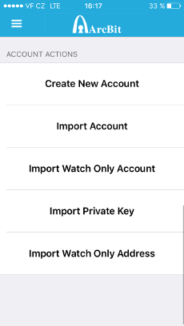

ArcBit
======

What is ArcBit?
---------------

`ArcBit <http://arcbit.io/>`_ is an open-source full featured, yet intuitive Bitcoin wallet for iOS, which lets you safely watch over your TREZOR transactions.

Scan one or more of your account public keys with ArcBit and keep a close watch on your new incoming transactions.
ArcBit also allows you to generate new receiving addresses, so you can accept bitcoin payments directly into TREZOR without the device being present.
For TREZOR accounts, ArcBit cannot sign transactions and send your bitcoins so it is only useful as a **watch only wallet**.

Resources
^^^^^^^^^

- `Website <http://arcbit.io>`_
- `Download for iOS <https://itunes.apple.com/us/app/arcbit-bitcoin-wallet/id999487888>`_, `Source on GitHub <https://github.com/arcbit/arcbit-ios>`_
- `Twitter <https://twitter.com/arc_bit>`_

TREZOR User Manual
------------------

Once you have ArcBit installed on your phone, go to Settings > Advanced options and Enable advanced mode.

Adding watch-only account or address
^^^^^^^^^^^^^^^^^^^^^^^^^^^^^^^^^^^^

To import your TREZOR account, go to `myTREZOR.com <https://mytrezor.com>`_ and click on the name of your device.
In Basic tab, reveal your account public keys by clicking on Show XPUBs and select account you want to import into ArcBit.

.. image:: images/coinsimple-mytrezor01.png

In ArcBit, make sure you have advanced mode enabled, go to Accounts, select Import Watch Only Account > Import via QR code and scan QR code in MyTrezor.
If you can't use your phone camera, select Import via text input instead and type/paste the public key in. After the import, ArcBit will scan for all transactions
related to the account. You can see them by going to History in the main menu.

You can also watch an individual address by selecting Import Watch Only Address.

.. image:: images/arcbit03.png

.. image:: images/arcbit01.png

Properties and Features
-----------------------

=================================================== =================== ===========================================================================================================
Wallet Property                                                         Description
----------------------------------------------------------------------- -----------------------------------------------------------------------------------------------------------
:icon:`laptop` Platform                 			✔                   iOS
:icon:`money` Coin(s)                   			✔                   Bitcoin
:icon:`language` Languages                          ✔                   English                   
:icon:`eye-slash` Watch-only mode                   ✔                   Importing watch-only account and generating new receiving address
:icon:`bars` Multiple Accounts           			✔					Capable of working with multiple accounts
=================================================== =================== ===========================================================================================================
