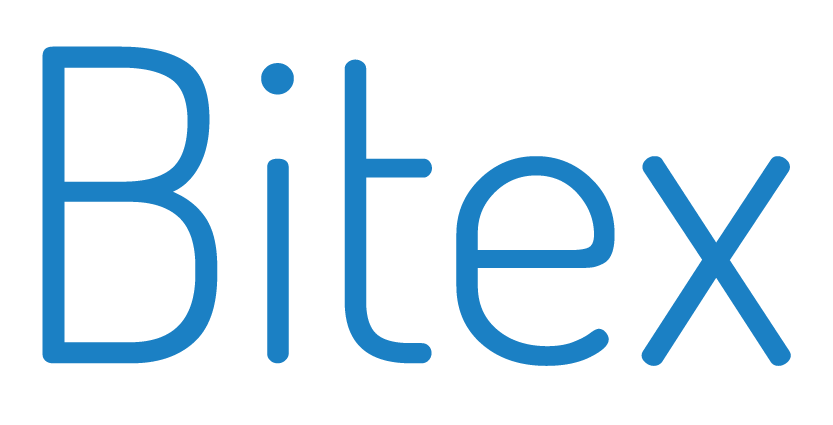
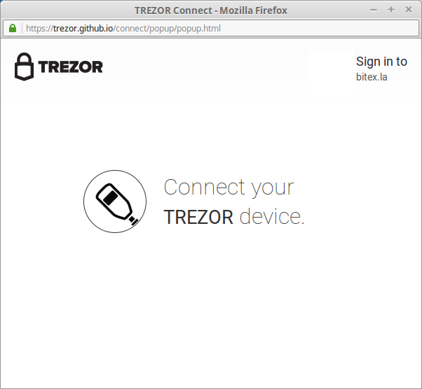

Bitex.la
========

What is Bitex.la?
-----------------

`Bitex.la <https://bitex.la>`_ is a bitcoin exchange, financial services and liquidity provider for the region of Latin America. 
People can now be part of the global economy with the safety only TREZOR can provide with its passwordless and secure authentication. 
Sign in with TREZOR and start buying, selling and trading bitcoin.

Resources
^^^^^^^^^

- `Website <https://bitex.la>`_
- `Support <mailto:hola@bitex.la>`_

TREZOR User Manual
------------------

Before you can Sign in with TREZOR, you have to **sign up with username & password** first. 

**To pair the TREZOR device with your account**, select Account Settings and scroll down until you see TREZOR Login section. 
Connect your TREZOR to your computer and click Sign in with TREZOR.

.. image:: images/bitex02.png

You will be asked to connect your TREZOR and confirm the action.

Authenticate with your PIN. Note, that PIN is never asked again until you disconect the device. Done!

From now on you will be able to Sign in with TREZOR to your Bitex.la account and never again worry that your password
might be stolen by a keylogger. Go ahead and try it! Log out, go to the login page, select Sign-in with TREZOR 
and confirm the action on your TREZOR. You have just singed in to Bitex.la using TREZOR.

In case you ever need to unlink your TREZOR, you can do it easily in user preference section. After clicking on Unlink your TREZOR device.

.. image:: images/bitex08.png

Of course, you can easily relink the device again whenever you want.
