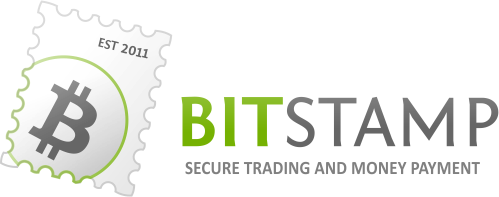

Bitstamp
========

What is Bitstamp?
-----------------

`Bitstamp <https://www.bitstamp.net>`_ Bitstamp is a bitcoin exchange based in Luxembourg. It allows trading between FIAT currency and bitcoin cryptocurrency.
Thanks to `the support for TREZOR, exchanging your funds safely and more secure that ever before!

Resources
^^^^^^^^^

- `Website <https://www.bitstamp.net>`_
- `Docummentation <https://www.bitstamp.net/faq/>`_, `News <https://www.bitstamp.net/news/>`_, `Support <https://www.bitstamp.net/faq/>`_

TREZOR User Manual
------------------

Deposit funds with TREZOR
^^^^^^^^^^^^^^^^^^^^^^^^^

With Bitstamp, users gain a convenient new way to transfer bitcoins directly from their Trezor wallet to an account.
This feature is great for everyone who loves TREZOR security.

1) Log into Bitstamp account.
2) Go to Deposit -> Bitcoin -> HD Wallet -> Trezor.
3) Select desired amount and click on "Deposit".
4) Connect your TREZOR and follow the instructions.
5) Authenticate to your TREZOR with PIN/Passphrase.
6) Choose the account you want to send the bitcoins from.
7) Check and confirm the transaction on the Trezor screen. Done.

.. image:: images/bitstamp.gif

Withdrawal funds with TREZOR
^^^^^^^^^^^^^^^^^^^^^^^^^^^^

1) Log into Bitstamp account.
2) Go to Withdrawal -> Bitcoin -> HD Wallet -> Trezor.
3) Connect your TREZOR and follow the instructions.
4) Authenticate to your TREZOR with PIN/Passphrase.
5) Choose the account you want to send the bitcoins to.
6) Select desired amount and click on "Withdrawal".
7) Confirm the withdrawal transaction via received e-mail. Done.
