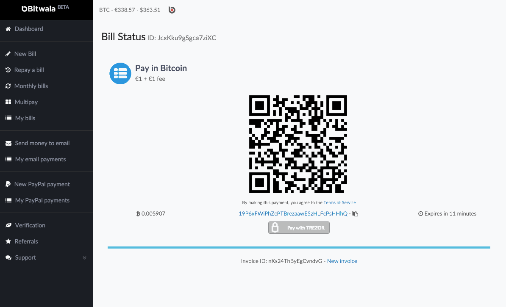

Bitwala
===================

.. image:: images/bitwala_logo.png

What is Bitwala?
-------------------------

`Bitwala <https://bitwa.la>`_ is a Bitcoin payment service - Pay your EUR bills using bitcoin. Fast, easy and secure. No bank account required.
Thanks to `the support for TREZOR <http://about.bitwa.la/bitwala-is-introducing-trezor>`_, paying your Euro bills securely is now even easier than ever before.

Resources
^^^^^^^^^

- `Website <https://bitwa.la>`_
- `Docummentation <http://about.bitwa.la>`_, `Blog <http://about.bitwa.la/news>`_, `Support <http://about.bitwa.la/contact>`_

TREZOR User Manual
------------------

Pay with TREZOR
^^^^^^^^^^^^^^^

With Bitwala, users gain a convenient new way to transfer bitcoins directly from their Trezor wallet to a bank account of their choice. 
Pay with TREZOR feature will be appreciated by all users who would like to pay bills with bitcoins or cash out in a simple manner:

1) Log into Biwala account.
2) Create a bill, email pay or PayPal payment.
3) Click on the "Pay with Trezor" button.
4) Connect your TREZOR and follow the instructions.
5) Authenticate to your TREZOR with PIN.
6) Choose the account you want to send the bitcoins from.
7) Check and confirm the transaction on the Trezor screen. Done.

