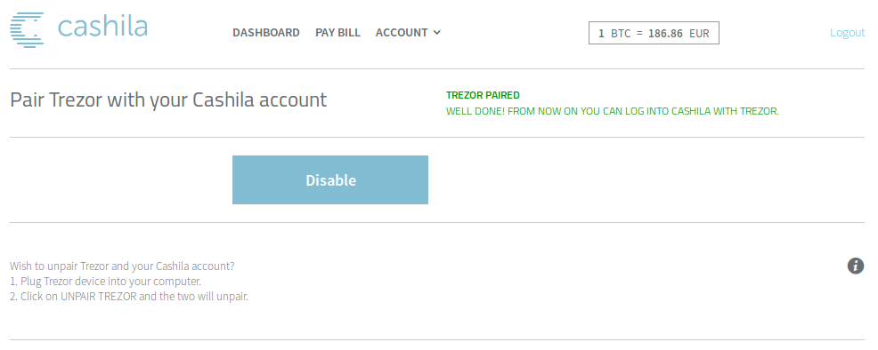
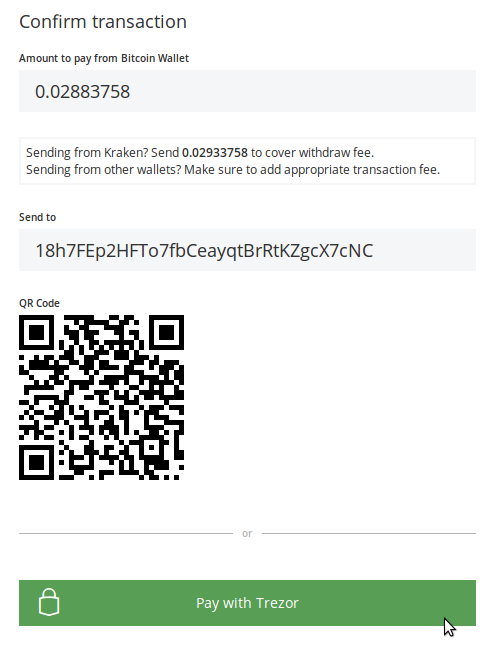

Cashila
===================

.. image:: images/cashila_logo.png

What is Cashila?
-------------------------

`Cashila <https://cashila.com>`_ is a Bitcoin payment service - an efficient way to send money, 
make purchases or pay bills with Bitcoin. With Cashila, you can enjoy the convenience of paying
bills online from anywhere in the world, at any time, fast and secure within Eurozone countries. 

Thanks to the support for TREZOR Connect, you can now 
`Sign in securely without any password <https://blog.cashila.com/2015/08/25/cashila-now-supports-a-simple-and-safe-log-in-with-trezor/>`_
and `pay your Euro bill easily using your TREZOR <https://blog.cashila.com/2015/08/25/cashila-now-supports-a-simple-and-safe-log-in-with-trezor/>`_.

Resources
^^^^^^^^^

- `Website <https://cashila.com>`_
- `FAQ <https://www.cashila.com/faq/trezor>`_, `Blog <https://blog.cashila.com>`_, `Support <mailto:support@cashila.com>`_

TREZOR User Manual
------------------

Sign in with TREZOR
^^^^^^^^^^^^^^^^^^^

Before you can Sign in with TREZOR, you need **to pair your device with Cashila account**. 

1) Log in and select Account > Pair Trezor.
2) Connect your device and click on Pair with TREZOR button. 
3) Confirm the action on TREZOR.
4) Authenticate to your TREZOR with PIN.
5) Authenticate to Cashisla with account password to complete pairing. 

From now on, you will be able to Sign in with TREZOR and do not worry that your password might be stolen by a keylogger ever again.

In case you ever need to **unlink your TREZOR**, just go to Account > Pair Trezor and click on Disable button. 
You will get confirmation that your TREZOR link was removed. Of course, you can easily relink the device again whenever you want.

Pay with TREZOR
^^^^^^^^^^^^^^^

With Cashila, users gain a convenient new way to transfer bitcoins directly from their Trezor wallet to a bank account of their choice. 
Pay with TREZOR feature will be appreciated by all users who would like to pay bills with bitcoins or cash out in a simple manner:

1) Log into Cashila account.
2) Go to Pay > Send. Enter all of the necessary payment details.
3) Click the Next button, and connect your TREZOR.
4) As payment option choose Trezor
5) Authenticate to your TREZOR with PIN.
6) Choose the account you want to send the bitcoins from.
7) Check and confirm the transaction on the Trezor screen. Done.

