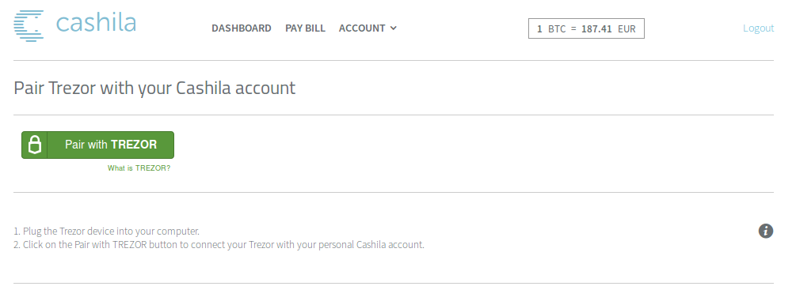
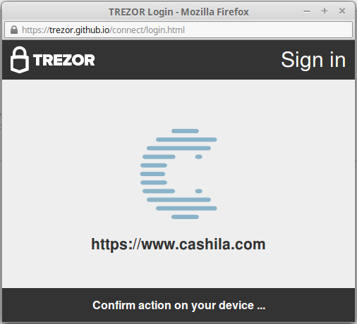

Cashila
===================

.. image:: images/cashila_logo.png

What is Cashila?
-------------------------

`Cashila <https://cashila.com>`_ is a Bitcoin payment service - an efficient way to send money, 
make purchases or pay bills with Bitcoin. With Cashila, you can enjoy the convenience of paying
bills online from anywhere in the world, at any time, fast and secure within 19 Eurozone countries. 

Thanks to the support for `Sign in with TREZOR <../trezor-tech/api-connect.html>`_, 
you can now manage your account with Cashila securely without any password.

Resources
---------

- `Website <https://cashila.com>`_
- `FAQ <https://www.cashila.com/faq>`_
- `Blog <https://blog.cashila.com>`_
- `Support <mailto:support@cashila.com>`_

TREZOR User Manual
------------------

Before you can Sign in with your TREZOR, you have to **sign up with email & password** first. 
**To pair the TREZOR device with your Cashila account**, log in and select Account > Pair Trezor.

Now connect your TREZOR and click on Pair with TREZOR button. You will be asked to confirm the action on your TREZOR

and authenticate with your PIN. Note, that PIN is never asked again until you disconect and reconnect the device.

.. image:: images/coinpayments10.png

Finally, enter your account password and complete the procedure. 

.. image:: images/cashila03.png

From now, you will be able to Sign in with TREZOR and **never again worry that your password might be stolen by a keylogger**. Go ahead and try it!

In case you ever need to **unlink your TREZOR**, just go to Account > Pair Trezor and click on on Disable. 
You will get confirmation that your TREZOR link was removed. Of course, you can easily relink the device again whenever you want.
