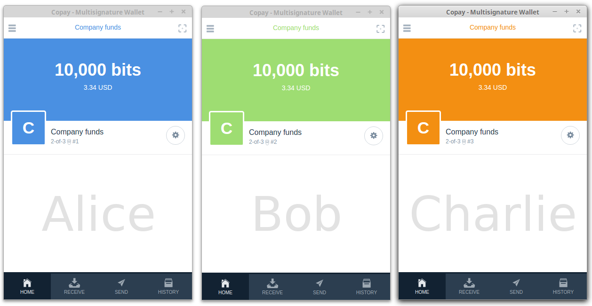
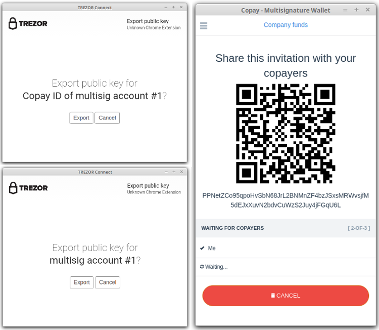
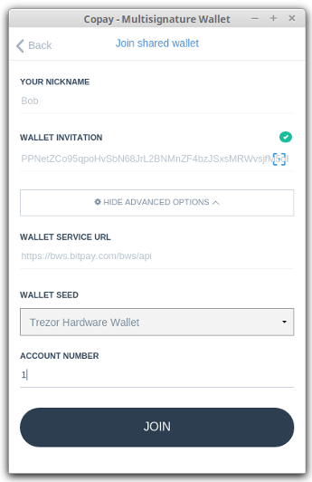
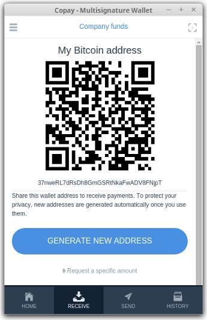
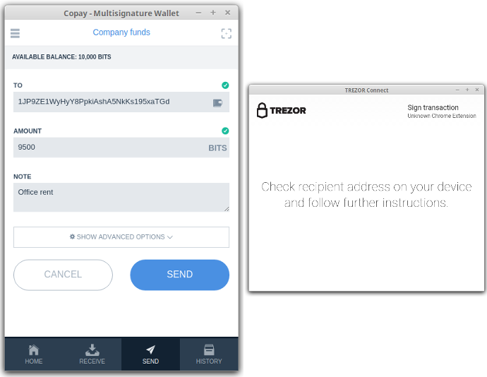
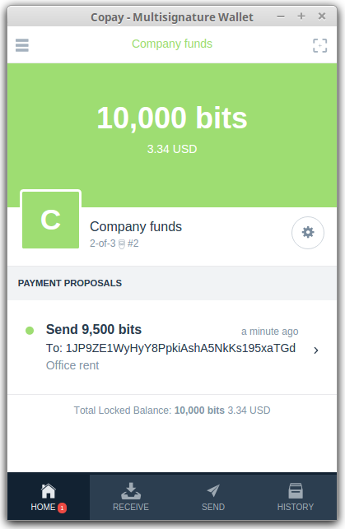
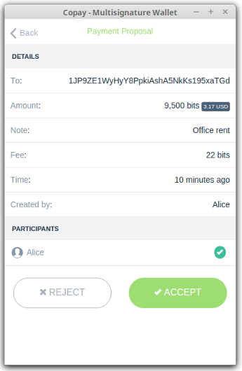
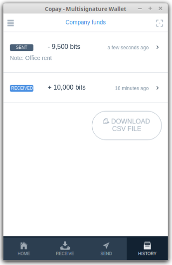

Copay
=====

.. image:: images/copay_logo.png 

What is Copay?
--------------

`Copay <https://copay.io>`_ is an open-source Bitcoin wallet for mobile or PC. Using Copay and TREZOR together, you can create **shared wallets** with an ease and security for the first time.

Resources
^^^^^^^^^

- `Website <https://copay.io>`_
- `Download for Chrome <https://chrome.google.com/webstore/detail/copay/cnidaodnidkbaplmghlelgikaiejfhja>`_
- `Documentation and source code <https://github.com/bitpay/copay>`_
- `Recovery manual <https://github.com/bitpay/copay/blob/master/backupRecovery.md>`_

TREZOR User Manual
------------------

Using Copay wallet and Trezor together
^^^^^^^^^^^^^^^^^^^^^^^^^^^^^^^^^^^^^^

On your PC, Copay can be used with Trezor as an alternative to MyTrezor. After you import one of your Trezor accounts into Copay, 
you will be able to check its balance, transaction history and send payments from it. More profoundly, Copay is one the first bitcoin apps, that lets
you create shared (or multisignature) wallet . Below, we provide an example how three company owners can create and manage a shared wallet.

Creating 2-of-3 shared wallet
-----------------------------

Imagine that Alice, Bob and Charlie are managing company bitcoin funds together. For this purpose they will create 2-of-3 shared wallet where transactions has to be signed by two of them. Thus when Alice creates and signs transaction proposal, she needs Bob or Charlie to coopeate and sign her proposal to make a transaction on behalf of the company.

Alice initiates shared wallet creation in Copay using her Trezor and then she shares invitation with Bob and Charlie, so that can join the wallet using their Trezors.

From application menu in Copay, she selects **Add Wallet** > **Create New Wallet**. After filling out her name and wallet parameters on the **Shared Wallet** tab, she selects Trezor Hardware Wallet from Wallet Seed menu and enters an unused shared Trezor account.

.. image:: images/copay01.png

.. important:: Shared accounts (BIP48) are different from your personal accounts (BIP44) and can't be viewed in MyTrezor. User must choose a unique shared account number that is not already used in other shared wallet. If selected account is not unique, Copay will notify user.

When Alice confirms to **Create 2-of-3 Wallet**, Trezor Connect dialog will appear and let Alice to connect her TREZOR, authenticate with PIN, check and confirm the action. After exporting two account public keys, Copay will display **wallet invitation**, secret that will Alice share with their colleagues.

To join the created wallet, Bob and Charlie have to launch their Copay app and select **Add Wallet** > **Join Shared Wallet**, paste the wallet invitation. Since they want to join using their TREZORs, they will select Trezor Hardware Wallet from Wallet Seed menu and enter an unused shared Trezor account in the similar way as Alice and hit **Join**. After everybody joins, all copayers will be able to see a new wallet in their Copay app.

.. image:: images/copay06b.png

Receiving payment in shared wallet
----------------------------------

Receiving payments in shared wallet is similar as with personal wallet. Each copayer can generate an unused receiving address in the Receive tab. Received payments are displayed in the History tab.

           
Note that Alice doesn't have to worry about coordination of her receiving address with Bob and Charlie because unique address is displayed for each copayer all the time. 

Sending payment from shared wallet
^^^^^^^^^^^^^^^^^^^^^^^^^^^^^^^^^^

Sending payment from shared wallet requires cooperation of other copayers. When Alice decides to send company bitcoins, she goes to Send tab, enters recipient address and amount. When she confirms to Send the transactions, Trezor Connect dialog will appear and let Alice to connect her TREZOR, authenticate with PIN, check and confirm the transaction on TREZOR's display.

After Alice signs the transaction, a payment proposal is created and Bob and Charlie are notified about it. When Bob opens his Copay, he will see the payment proposal in the Home tab. He can go on and check the details. When he decides to Accept the proposal, he will sign it in the same way as Alice, which (in case of 2-of-3 wallet) will finilize the payment proposal and transaction will be published.

Meanwhile Alice can monitor the state of her payment proposal. When the trasaction is finilized she will see "Payment sent" confirmation. Alice, Bob and Charlie can always check all the transactions later in History tab.

.. image:: images/copay10a.png

Creating watch-only wallet on any mobile device
-----------------------------------------------

Copay wallet is supported on all major mobile devices (Android, iOS and Windows) and can be used as a watch-only wallet for any number of your TREZOR accounts even 
if you use other client wallet then Copay with your TREZOR. Here is how you do it:

- Install `Copay Chrome App <https://chrome.google.com/webstore/detail/copay/cnidaodnidkbaplmghlelgikaiejfhja>`_ on your PC and open it.
- Go to Add wallet > Create new wallet > Personal wallet
- As Wallet seed select Trezor Hardware wallet and enter account number to import and hit Create new wallet. Note that in Copay, accounts are numbered from 0.
- Go to wallet settings and Advanced > Export wallet 
- Enter export password. This is required but not critical for public account export, so you can enter simple password like one letter.
- Turn off Include address book and history cache and hit Download
- Send the file to your phone by email
- Install Copay phone app, open it and go to Add wallet > Import wallet > File/text backup 
- Paste the contents of exported file, enter your password and hit Import. Done.

After a while, your account transaction history will synchronize. You may import any number of your TREZOR accounts this way.

Properties and Features
-----------------------

=================================================== =================== ===========================================================================================================
Wallet Property                                                         
-----------------------------------------------------------------------------------------------------------------------------------------------------------------------------------
:icon:`laptop` Platform                 			✔                   Windows, Linux, OSX with Chrome Extension
:icon:`money` Coin(s)                   			✔                   Bitcoin
:icon:`language` Languages                          ✔                   English, Spanish, German, Italian, Japaneese and many others.              
:icon:`book` Address Book                           ✔                   Manage contact list of receiving and sending addresses
:icon:`comment` Labelling                			✔ 					Add comments and labels to accounts and transactions
:icon:`bell-o` Notifications              			✔ 					Transaction notifications via email or SMS
Trezor Feature                                                          
-----------------------------------------------------------------------------------------------------------------------------------------------------------------------------------
:icon:`exchange` Simple transactions    			✔					Sign transaction with TREZOR and confirm address and amount on display
:icon:`users` Multisig transactions                 ✔                   Sign shared (multisignature) transaction with TREZOR
:icon:`user-secret` Hidden Wallets  			    ✔                   User can access hidden wallets each behind arbitrary passphrase
:icon:`bars` Multiple Accounts           			✔					Capable of creating and working with multiple accounts
:icon:`th` Smart PIN Matrix             			✔					Keylogger protection, displaying PIN matrix on TREZOR's display
:icon:`eye-slash` Watch-only mode                   ✔                   Remembering account, generating new receiving address with TREZOR disconected
:icon:`eye`  Show on TREZOR     			          					Phishing protection, validation receiving address on TREZOR
:icon:`envelope` Sign & Verify Message                                  Securely sign and verify short text
:icon:`lock` Wallet Encryption                                          Wallet can be decrypted and opened using TREZOR only
:icon:`lock` Sign in with TREZOR                                        TREZOR is used for online authentication without using username and password
Trezor Management                                                       
-----------------------------------------------------------------------------------------------------------------------------------------------------------------------------------
:icon:`cog` Basic Setup                 			                    Generate new wallet with recovery seed, set PIN and label device
:icon:`life-ring` Safe Recovery         			                    Recover TREZOR by safely entering your recovery seed (12, 18 or 24 words)
:icon:`sliders` Change PIN              			                    User can change TREZOR's PIN
:icon:`sliders` Change Name          			   	                    User can change TREZOR's name
:icon:`paint-brush` Custom Homescreen            	 					User can upload personalized default screen
:icon:`upload`  Update Firmware         			   					Notify user and update firmware when new version is available
:icon:`fire` Wipe device                 			 					Erase private keys from TREZOR
:icon:`magnet` Fast Recovery                                            Recover by directly loading seed into TREZOR, fast but less safe way to recover wallet
=================================================== =================== ===========================================================================================================
