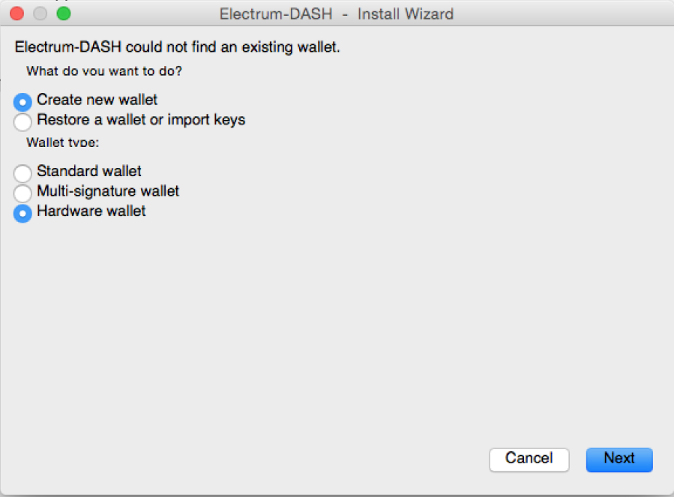

Electrum-Dash
=============

.. image:: images/electrum-dash_logo.png

What is Electrum-Dash?
----------------------

`Electrum-Dash <https://www.dash.org/news/electrum-dash-with-trezor-support-released>`_ 
is a DASH lightweight desktop wallet for Windows, Linux and Mac OS based on Electrum.

Resources
^^^^^^^^^

- `Website <https://www.dash.org/news/electrum-dash-with-trezor-support-released>`_
- `Dowload <https://www.dash.org/downloads>`_ (scroll down to Electrum-Dash)
- `Source code <https://github.com/dashpay/electrum-dash>`_
- `Online guide <https://dashpay.atlassian.net/wiki/display/DOC/Using+Trezor+with+Dash>`_

TREZOR User Manual
------------------

Electrum-Dash is a fork of `Electrum <electrum.html#trezor-user-manual>`_ wallet and works much like it. 
To import your public account keys, connect your TREZOR, start Encompass and select Create wallet and Hardware wallet as Wallet type.
If you already have another wallet, select New Wallet from File menu first.

Properties and Features
-----------------------

=================================================== =================== ===========================================================================================================
Wallet Property                                                         Description
----------------------------------------------------------------------- -----------------------------------------------------------------------------------------------------------
:icon:`laptop` Platform                 			✔                   Windows, Linux, OSX
:icon:`money` Coin(s)                   			✔                   DASH
:icon:`language` Languages                          ✔                   English                   
:icon:`book` Address Book                           ✔                   Manage contact list of receiving and sending addresses
:icon:`comment` Labelling                			✔					Add comments and labels to accounts and transactions
Trezor Feature                                                          Description
----------------------------------------------------------------------- -----------------------------------------------------------------------------------------------------------
:icon:`cog` Basic Setup                 			✔                   Generate new wallet with recovery seed, set PIN and label device
:icon:`life-ring` Safe Recovery         			                    Recover TREZOR by safely entering your recovery seed (12, 18 or 24 words)
:icon:`exchange` Simple transactions    			✔					Sign transaction with TREZOR and confirm address and amount on display
:icon:`users` Multisig transactions                                     Sign multisignature transaction with TREZOR
:icon:`user-secret` Hidden Wallets  			    ✔                   User can access hidden wallets each behind arbitrary passphrase
:icon:`bars` Multiple Accounts           			✔					Capable of creating and working with multiple accounts
:icon:`th`   Smart PIN Matrix           			✔					Keylogger protection, displaying PIN matrix on TREZOR's display
:icon:`eye-slash` Watch-only mode                   ✔                   Remembering account, generating new receiving address with TREZOR disconected
:icon:`eye`  Show on TREZOR     			        ✔  					Phishing protection, validation receiving address on TREZOR
:icon:`sliders` Change PIN              			                    User can change TREZOR's PIN
:icon:`sliders` Change Name          			   	✔                   User can change TREZOR's name
:icon:`paint-brush` Custom Homescreen            	 					User can upload personalized default screen
:icon:`upload`  Update Firmware         			   					Notify user and update firmware when new version is available
:icon:`fire` Wipe device                 								Erase private keys from TREZOR
:icon:`envelope` Sign Message                       ✔                   Securely sign short text
:icon:`envelope` Verify Message                                         Securely verify short text
:icon:`magnet` Fast Recovery                                            Recover by directly loading seed into TREZOR, fast but less safe way to recover wallet
:icon:`lock` Wallet Encryption                                          Wallet can be decrypted and opened using TREZOR only
:icon:`lock` Sign in with TREZOR                                        TREZOR is used for online authentication without using username and password
=================================================== =================== ===========================================================================================================
