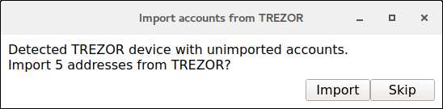
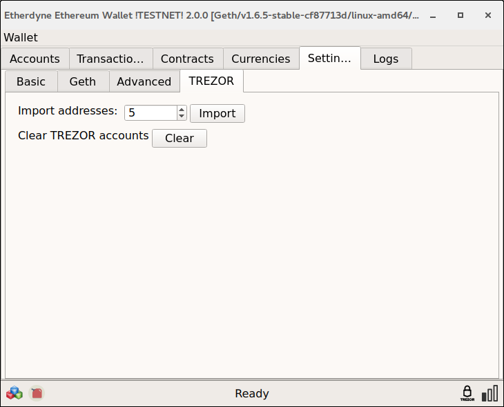
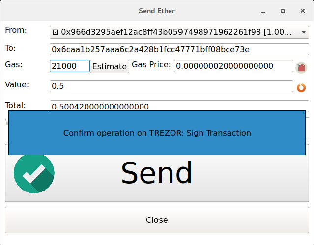

Etherwall
========

.. image:: images/etherwall_logo.png

What is Etherwall?
-----------------

`Etherwall <https://www.etherwall.com/>`_ is a desktop Ethereum wallet for Windows, Mac OS X and Linux.

Resources
^^^^^^^^^

- `Website <https://www.etherwall.com>`_

TREZOR User Manual
------------------

Make sure to set up your trezor on <https://trezor.io> before using it with Etherwall.

Importing accounts from TREZOR
-----------------------------

Etherwall should detect TREZOR and provide an import popup dialog
when first inserted.

If you didn't get the import dialog or need to import additional accounts go to
settings/TREZOR tab and click the import button. You can also set the number of
accounts to import here, default is 5.

If you set up PIN and/or password protection on your TREZOR the authentication
popups will show up.
Note that PIN is required only once per TREZOR connection session.

.. image:: images/etherwall03.png

Confirm the operation on your device and your accounts will show up with the
TREZOR indicator on the left side.

.. image:: images/etherwall04.png

Sending transaction from imported account
-----------------------------------------

To send transaction from TREZOR account you need to connect your TREZOR.
Prepare your transaction in the transactions dialog as usual.
Hit the Send button, check the transaction on TREZOR screen and confirm it.

.. image:: images/etherwall05.png

Properties and Features
-----------------------

=================================================== =================== ===========================================================================================================
Wallet Property                                                         Description
----------------------------------------------------------------------- -----------------------------------------------------------------------------------------------------------
:icon:`laptop` Platform                             ✔                   Windows, Mac OS X, Linux
:icon:`money` Coin(s)                               ✔                   Ethereum
:icon:`language` Languages                          ✔                   English
:icon:`book` Address Book                           ✔                   Manage contact list of receiving and sending addresses
:icon:`comment` Labelling                           ✔                   Label addresses
=================================================== =================== ===========================================================================================================

=================================================== =================== ===========================================================================================================
TREZOR Feature                                                          Description
----------------------------------------------------------------------- -----------------------------------------------------------------------------------------------------------
:icon:`cog` Basic Setup                                                 Generate new wallet with recovery seed, set PIN and label device
:icon:`life-ring` Safe Recovery                                         Recover TREZOR by safely entering your recovery seed (12, 18 or 24 words)
:icon:`exchange` Simple transactions                ✔                   Sign transaction with TREZOR and confirm address and amount on display
:icon:`users` Multisig transactions                                     Sign multisignature transaction with TREZOR
:icon:`user-secret` Hidden Wallets                  ✔                   User can access hidden wallets each behind arbitrary passphrase
:icon:`bars` Multiple Accounts                      ✔                   Capable of creating and working with multiple accounts
:icon:`th`   Smart PIN Matrix                       ✔                   Keylogger protection, displaying PIN matrix on TREZOR's display
:icon:`eye-slash` Watch-only mode                                       Remembering account, generating new receiving address with TREZOR disconected
:icon:`eye`  Show on TREZOR                                             Phishing protection, validation receiving address on TREZOR
:icon:`sliders` Change PIN                                              User can change TREZOR's PIN
:icon:`sliders` Change Name                                             User can change TREZOR's name
:icon:`paint-brush` Custom Homescreen                                   User can upload personalized default screen
:icon:`upload`  Update Firmware                                         Notify user and update firmware when new version is available
:icon:`fire` Wipe device                                                Erase private keys from TREZOR
:icon:`envelope` Sign Message                                           Securely sign short text
:icon:`envelope` Verify Message                                         Securely verify short text
:icon:`magnet` Fast Recovery                                            Recover by directly loading seed into TREZOR, fast but less safe way to recover wallet
:icon:`lock` Wallet Encryption                                          Wallet can be decrypted and opened using TREZOR only
:icon:`lock` Sign in with TREZOR                                        TREZOR is used for online authentication without using username and password
=================================================== =================== ===========================================================================================================
