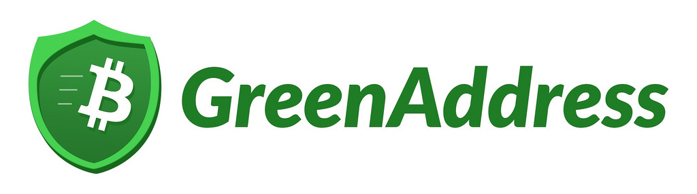

GreenAddress
============

What is GreenAddress?
---------------------

`GreenAddress <https://www.greenaddress.it/>`_ is a wallet service that allow you to create shared wallet with GreenAddress holding one of the wallet keys.

.. important:: GreenAddress is recommended for advanced users who fully understand how the service works and how to recover the wallet if the service becomes unavailable. Note that in such a case, TREZOR seed have to be entered into one of the GreenAddress recovery tools on a generally insecure computer.

Resources
^^^^^^^^^

- `Website <https://greenaddress.it/en/>`_
- `Download GreenAddress for Chrome <https://chrome.google.com/webstore/detail/greenaddress/dgbimgjoijjemhdamicmljbncacfndmp>`_, `Source code <https://github.com/greenaddress/WalletCrx>`_
- `Download Greenbits for Android <https://play.google.com/store/apps/details?id=com.greenaddress.greenbits_android_wallet&hl=en>`_, `Source code <https://github.com/greenaddress/GreenBits>`_

TREZOR User Manual
------------------

GreenAddress can be used with TREZOR on PC through `Chrome app <https://chrome.google.com/webstore/detail/greenaddress/dgbimgjoijjemhdamicmljbncacfndmp>`_.
To initilize your TREZOR with the service, follow this `step-by-step manual <https://blog.greenaddress.it/how-to-initialize-your-trezor-with-greenaddress-services>`_.
Once the setup is finished you can access your GreenAddress wallet also or your Android phone using 
`Greenbits app <https://play.google.com/store/apps/details?id=com.greenaddress.greenbits_android_wallet&hl=en>`_.

.. image:: images/greenaddress01.png
