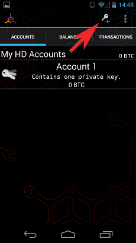
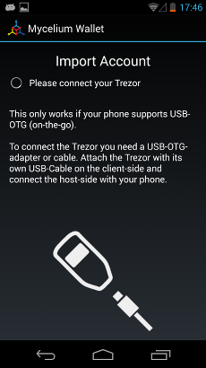
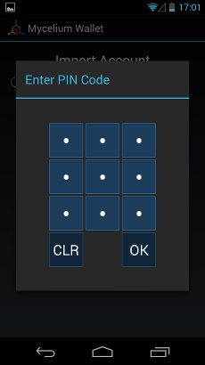
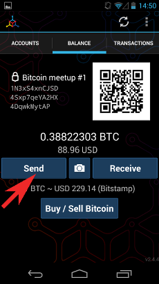
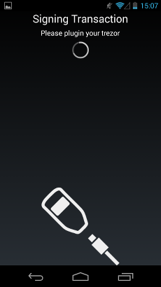
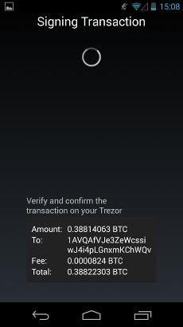

Mycelium
========

.. image:: images/mycelium_logo.png 

What is Mycelium?
-----------------

`Mycelium <https://mycelium.com/>`_ is a mobile Bitcoin wallet for Android and iOS, although TREZOR is curently supported only on Android device.

Resources
^^^^^^^^^

- `Website <https://mycelium.com>`_
- Download for `Android <https://play.google.com/store/apps/details?id=com.mycelium.wallet>`_, `iOS <https://itunes.apple.com/ca/app/mycelium-bitcoin-wallet/id943912290>`_

TREZOR User Manual
------------------

Before you can start using Mycelium with your TREZOR, make sure you have an OTG cable for connecting TREZOR to your phone or tablet.
Using TREZOR with Mycelium is pretty straighforward.

Importing account from TREZOR
-----------------------------

To import a TREZOR account into Mycelium, go to Accounts tab, select Add New Account (key icon) > Advanced > Trezor.
Now, connect your TREZOR via OTG cable and confirm the access. Enter your TREZOR PIN (and also passphrase, if you have previously enabled passphrase feature) 
and wait until Mycelium loads all your TREZOR accounts.

Note that PIN is required only once per TREZOR connection session. 

Select TREZOR account the list to import it into Mycelium, give it a name and wait until Mycelium synchronizes all the transactions and balance.
If you need to import more accounts, repeat the steps above. To import a new empty TREZOR account, select Import next unused account below TREZOR account list.

.. image:: images/mycelium04.png
           :align: center

Without TREZOR device connected, imported accounts work in **watch-only mode**. You can check total balance, transaction history and display next unsused receiving address,
but **you cannot send any transaction**.

Sending transaction from imported account
-----------------------------------------

To send transaction from TREZOR account you need to connect your TREZOR. Select Send from Balance tab and enter recipient address and amount. 
Hit the Send button, check the transaction on TREZOR screen and confirm it.

Sending transaction from TREZOR directly
----------------------------------------

You can also send transaction directly from TREZOR using Mycelium without importing it first. Simply connect your TREZOR and select **Cold Storage** from app menu 
and choose Trezor. After Mycelium loads your TREZOR accounts, select the one you want to spend from, enter recipient address and amount and finalize the transaction
by checking and confirming it on TREZOR.

Importing watch-only accounts from MyTrezor
-------------------------------------------

If you want to use Mycelium as a watch-only wallet for your TREZOR, you can import accounts directly from MyTrezor without connecting the device.

In `MyTrezor.com <https://mytrezor.com>`_, click on the name of your TREZOR and in Basic settings, click on Show XPUBs. 
Select account you want to import into Mycelium to reveal QR code with account public key.

.. image:: images/coinsimple-mytrezor01.png

In Mycelium, go to Accounts tab, select Add New Account (key icon) > Advanced > Scan and scan QR code from MyTrezor to import the account. 
Give it a name and wait until Mycelium synchronizes it. 

After that, you will be able to check balance, transaction history and display next unsused receiving address.

Properties and Features
-----------------------

=================================================== =================== ===========================================================================================================
Wallet Property                                                         Description
----------------------------------------------------------------------- -----------------------------------------------------------------------------------------------------------
:icon:`laptop` Platform                 			✔                   Android
:icon:`money` Coin(s)                   			✔                   Bitcoin
:icon:`language` Languages                          ✔                   English and many others.              
:icon:`book` Address Book                           ✔                   Manage contact list of receiving and sending addresses
:icon:`comment` Labelling                			✔					Add comments and labels to accounts and transactions
=================================================== =================== ===========================================================================================================

=================================================== =================== ===========================================================================================================
Trezor Feature                                                          Description
----------------------------------------------------------------------- -----------------------------------------------------------------------------------------------------------
:icon:`cog` Basic Setup                 			                    Generate new wallet with recovery seed, set PIN and label device
:icon:`life-ring` Safe Recovery         			                    Recover TREZOR by safely entering your recovery seed (12, 18 or 24 words)
:icon:`exchange` Simple transactions    			✔					Sign transaction with TREZOR and confirm address and amount on display
:icon:`users` Multisig transactions                                     Sign multisignature transaction with TREZOR
:icon:`user-secret` Hidden Wallets  			    ✔                   User can access hidden wallets each behind arbitrary passphrase
:icon:`bars` Multiple Accounts           			✔					Capable of creating and working with multiple accounts
:icon:`th`   Smart PIN Matrix           			✔					Keylogger protection, displaying PIN matrix on TREZOR's display
:icon:`eye-slash` Watch-only mode                   ✔                   Remembering account, generating new receiving address with TREZOR disconected
:icon:`eye`  Show on TREZOR     			          					Phishing protection, validation receiving address on TREZOR
:icon:`sliders` Change PIN              			                    User can change TREZOR's PIN
:icon:`sliders` Change Name          			   	                    User can change TREZOR's name
:icon:`paint-brush` Custom Homescreen            	 					User can upload personalized default screen
:icon:`upload`  Update Firmware         			   					Notify user and update firmware when new version is available
:icon:`fire` Wipe device                 			 					Erase private keys from TREZOR
:icon:`envelope` Sign Message                                           Securely sign short text
:icon:`envelope` Verify Message                                         Securely verify short text
:icon:`magnet` Fast Recovery                                            Recover by directly loading seed into TREZOR, fast but less safe way to recover wallet
:icon:`lock` Wallet Encryption                                          Wallet can be decrypted and opened using TREZOR only
:icon:`lock` Sign in with TREZOR                                        TREZOR is used for online authentication without using username and password
=================================================== =================== ===========================================================================================================
