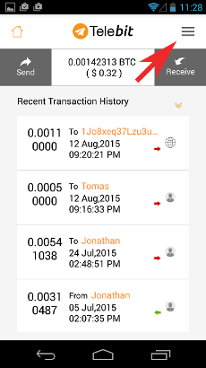
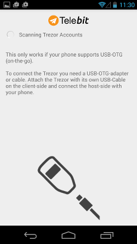
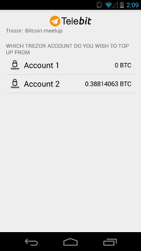
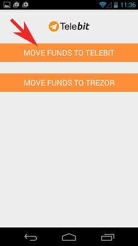
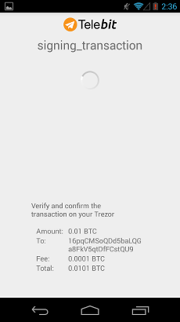
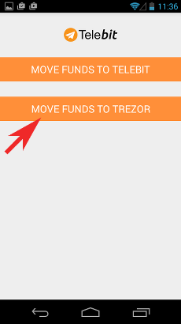
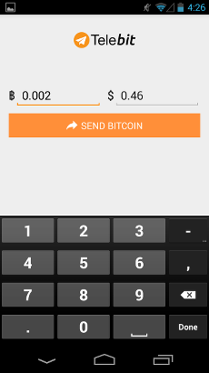
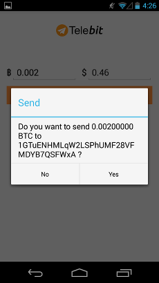

Telebit
=======

What is Telebit?
-----------------

`Telebit <http://www.telebit.org>`_ is a mobile Bitcoin wallet for Android coupled to Telegram, a messenger similar to WhatsApp 
but faster and more secure, meaning your messages can’t be spied on. With Telebit wallet, you can now move funds directly between your
TREZOR device and your Telegram account.

Resources
^^^^^^^^^

- `Website <http://www.telebit.org>`_
- `Download for Android <https://play.google.com/store/apps/details?id=com.nxb.telebit>`_
- `Tutorials <http://www.telebit.org/#!video-demos/c1c4>`_

TREZOR User Manual
------------------

Before you can start using Telebit with your TREZOR, make sure you have a `Telegram <https://telegram.org>`_ account 
and OTG cable for connecting TREZOR to your phone or tablet. You also will need to pair 
`Telebit <https://play.google.com/store/apps/details?id=com.nxb.telebit>`_ with your Telegram account 
(check setup tutorial `here <http://www.telebit.org/#!video-demos/c1c4>`_).

Sending your bitcoins between Telebit and TREZOR is pretty straightforward. Start by selecting TREZOR from menu, 
connect your device via OTG cable and confirm the access. Enter your TREZOR PIN and wait until Telebit loads all
your TREZOR accounts.

To **send funds from TREZOR to Telebit** select the source account and then select Move funds to Telebit. Enter the amount and 
confirm the transaction on your TREZOR.

.. image:: images/telebit08.png

To **receive funds from Telebit to TREZOR** select the account to receive and then select Move funds to Trezor. Enter the amount
and confirm the transaction.

To learn more about Telebit, check video tutorials `here <http://www.telebit.org/#!video-demos/c1c4>`_.

