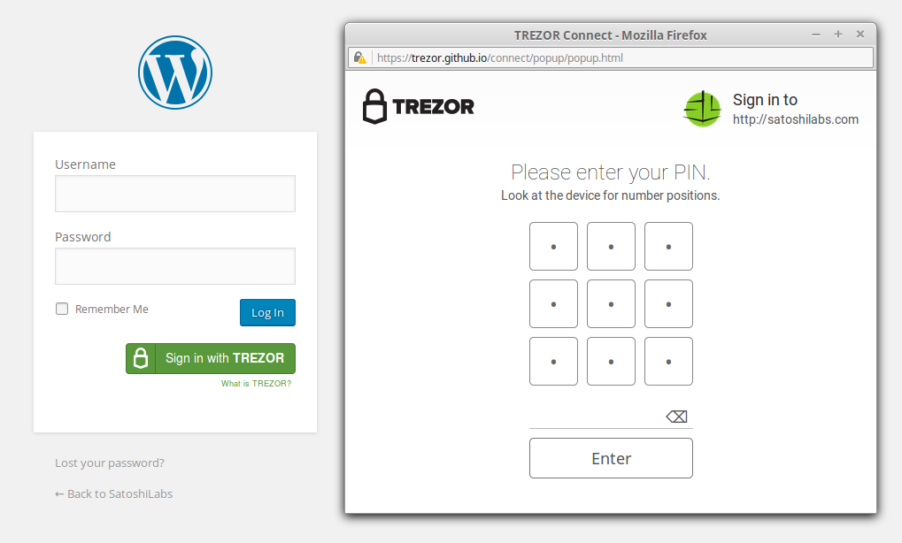

Wordpress
=========

.. image:: images/wordpress_logo3.jpg
           
What is Wordpress?
------------------

`Wordpress <https://wordpress.org/plugins/trezor-connect-plugin>`_ is web software you can use to create a website or blog. 

Thanks to **TREZOR Connect Plugin** by SatoshiLabs, administrators can now install Sign in with TREZOR 
feature with just a few clicks and enjoy passwordless and secure authentication to their Wordpress backend.

Resources
^^^^^^^^^

- `Website <https://wordpress.org/plugins/trezor-connect-plugin>`_
- `Souce code <https://github.com/trezor/trezor-wordpress-plugin>`_
- `Support (email) <mailto: support@bitcointrezor.com>`_
- `Blog <http://satoshilabs.com/news>`_, `Facebook <https://www.facebook.com/BitcoinTrezor>`_, `Twitter <https://twitter.com/BitcoinTrezor>`_, `Reddit <http://www.reddit.com/r/TREZOR/>`_

TREZOR User Manual
------------------

Setting up Wordpress Plugin
^^^^^^^^^^^^^^^^^^^^^^^^^^^

After logging into your admin Wordpress account

- Go to Plugins section, click on Add New
- Search for Trezor Connect Plugin and install it
- After successful installation, activate the plugin
- Go to TREZOR Connect section to set image for signing window

Now any site administrator will be able to pair his TREZOR with his Wordpress account.

.. image:: images/wordpress01.png

Pairing TREZOR with account
^^^^^^^^^^^^^^^^^^^^^^^^^^^

Before you can use your TREZOR for login, you have to pair it with your Wordpress account. 

- Under Users section, click on Your profile
- Scroll down to TREZOR Connect and click on Sign in with TREZOR
- Connect your TREZOR, confirm the action on your device and enter your PIN
- Finish the pairing by entering your Wordpress password

From now, you will be able to Sign in with TREZOR and **never again worry that your password might be stolen by a keylogger**. 
Go ahead, log out and try it!

.. image:: images/wordpress02.png

Unlinking TREZOR
^^^^^^^^^^^^^^^^

In case you ever need to unlink your TREZOR

- Under Users section, click on Your profile
- Scroll down to TREZOR Connect and click on Unlink TREZOR
- Confirm the action by entering your Wordpress password
