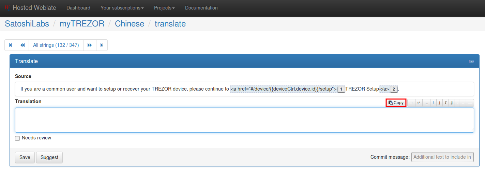

Weblate.org - Tool for translating
==================================

1. Register
--------------------

Please register by sending a request email to `support@trezor.io <mailto:support@trezor.io>`_ with the subject “Translation TREZOR Wallet (Language)”. Should we need your help, we would ask you to register at `Weblate.org <https://hosted.weblate.org>`_ and provide you with access to the translation project of TREZOR Wallet.

2. Log into Weblate & Choose language
------------------

Log into Weblate and, using the provided link, navigate to SatoshiLabs / TREZOR Wallet project.

Choose your language. In this example we are going to use Chinese.

.. important:: Please keep in mind the language you are selecting is actually the language you are going to translate **INTO**, not **FROM**. You will be always translating from English.

.. image:: images/weblate-language.png

3. Translate
------------

.. note:: We recommend to write down notes while translating so you know how you translated specific words and the translation stays consistent during the whole process. This comes really handy later as we can speak from our own experience.

.. important:: In some languages might be an option to choose between "official" and "unofficial" way of speach. We do prefer the more official way.

Please translate each string as exactly as possible, but main point is to keep the **original meaning**.

It's in the context of User Interface so it might be necessary to check the website relevant to the project for exact place where the string is used and see the whole context. If you are not exactly sure how to translate string please check the “Needs review” option and click Save. We will review those strings.

You will also find strings which contain placeholders and HTML tags. In that case use the Copy button on the right side to copy the whole string and translate only things placed out of those placeholders (for example following string):

  <b>%(key)s</b> changed from <b>%(old)s</b> to <b>%(new)s</b>

Please translate the **changed from** and **to** only. Placement of these special strings in sentence does not matter as long as you keep them spelled properly. If your language does require some specific word sequence, you may shuffle them.

It's easy to translate plaintext strings, however if you find strings with placeholders or html tags, we do suggest to Copy the string first and then rewrite words / phrases which should be translated

In case of any issues, difficulties or questions please check the `Weblate Documentation <https://docs.weblate.org/en/latest/>`_ or contact us at `support@trezor.io <mailto:support@trezor.io>`_

TREZOR Wallet Translation
=========================

Website: `TREZOR Wallet <https://wallet.trezor.io>`_

Languages To Be Translated
---------

* Chinese (simplified and traditional)
* Hindi
* Portuguese
* Russian
* Slovak
* Spanish

Languages Translated
---------

* Czech
* Dutch
* French
* German
* Greek
* Japanese
* Polish

Reward
------

For the complete translation of one language we offer a limited 2-color version of TREZOR or $100 worth of Bitcoin.
