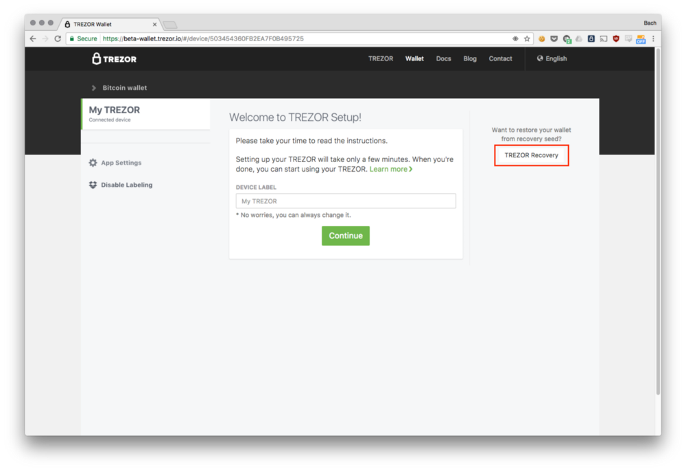

Advanced Recovery
=================

In contrast with the Standard Recovery, the Advanced Recovery completely obfuscates the letters entered on the computer. Instead of writing whole words in a shuffled order, you will be inputting individual letters on the PIN-pad in a regular order. The computer will never know what letter is being entered, as the layout of the PIN-pad constantly changes.

Advanced Recovery process
-------------------------

Using the Advanced Recovery will require more time compared to the Standard Recovery method. Start by plugging in your uninitialized TREZOR into your computer, navigate to the `TREZOR Wallet <https://wallet.trezor.io>`_ and select TREZOR Recovery.

Select the device label to your liking, and choose the length of your recovery seed (master seed). If you are recovering from a TREZOR, the length of the seed will be 24 words. Don’t forget to check the “Advanced recovery” checkbox before clicking on “Continue”.

.. image :: images/advrec2.png

And now to the recovery process itself: With Advanced Recovery, you will be choosing the individual letters that the seed word is composed of, as already mentioned. On your computer display, you will see a PIN-pad, like the one you use to enter your PIN.

.. image :: images/advrec3.png

On the TREZOR though, there will be no numbers. Instead, you will see a virtual keyboard composed of 9 buttons (like the one on the screen), each assigned to one, two or even three letters. You can choose the letter by clicking on the corresponding button on your computer. Like with the PIN entry, you will get a different layout every time.

We will be choosing the first four letters for each word. Each letter requires a selection on its own. This means that, in total, you will click on the computer screen 96 times, assuming you will not need to use the backspace to correct your choice.

.. image :: images/advrec4.jpeg

For instance, let’s say our first word is **“heavy”**. In order to select the first letter of the first word, we will click on the second button in the first row (first button in the second column), button **“H-L”**.

.. image :: images/advrec5.jpeg

Then, we will select the “second letter” of the word. Second letter of heavy is “E”, but to make this easier, the TREZOR will give you the preceding letter too. We will therefore choose the button **“HA-HE”**.

.. note:: Notice that it this selection might not necessarily be the second letter. In order to fit all the letters into a 9-key layout, keys “J” and “K” had to be hidden under “H-L”. In this case, if your word started with “J” or “K” then you would enter the first letter in this second selection.

.. image :: images/advrec6.jpeg

We come to the third letter (next letter) of the first word now. In comparison to the second choice, it may seem a bit more complicated, but in reality, it is not too bad. Let’s explain all the options, from top-left to bottom-right:

- **HA T-Z:** The first two letters of the word are “HA”, the third letter is any letter from T to Z
- **HEL:** Self-explanatory
- **HE N-R:** The first two letters of the word are “HE”, the third letter is any letter from N to R
- **HAR:** Self-explanatory
- **HA L-M:** The first two letters of the word are “HA”, the third letter is any letter from L to M
- **HE D-I:** The first two letters of the word are “HE”, the third letter is any letter from D to I
- **HA B-I:** The first two letters of the word are “HA”, the third letter is any letter from B to I
- **HA N-P:** The first two letters of the word are “HA”, the third letter is any letter from N to P
- **HEA:** Self-explanatory

Which one is ours? “HEA”.

.. image :: images/advrec7.jpeg

After the third letter, there is not much left to choose from. BIP39 wordlist was deliberately made so that there are no words with the same combination of four letters. Having three chosen, there are only a few options left. Choose “heavy” on the now shrunk PIN-pad and you are done with the first word! Repeat the same process for the next 23 words to finish the Advanced Recovery process.