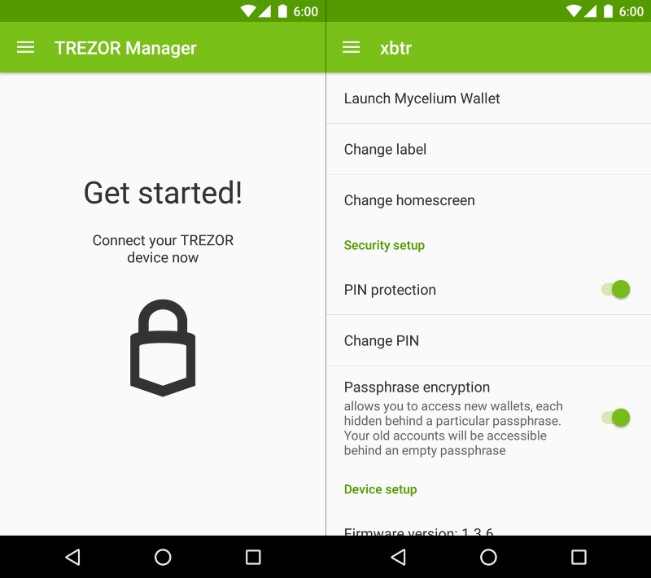
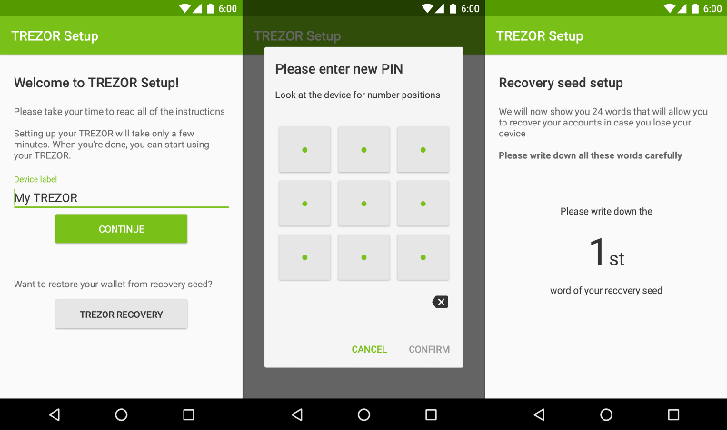
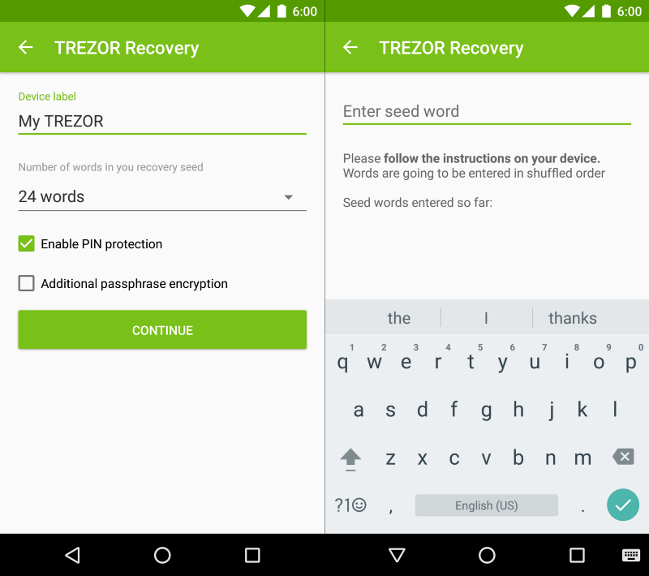
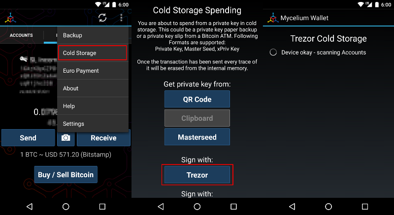

Using TREZOR with Android
=========================

TREZOR is becoming truly portable! With the release of our new TREZOR Manager application for Android, we are introducing an alternative method how to set up, customize and recover your TREZOR device even without a computer.

It should work on all phones that support USB Host. You will need an OTG cable to connect the TREZOR to your phone or tablet. The app was tested on LG Nexus 5 (Android 6) and Samsung Galaxy Alpha (Android 5).

Currently, the app can be only used for initializing the device, recovering the device, setting up the PIN code and passphrase, and some other settings.

In order to pay with TREZOR via your phone, you will have to install another application. The TREZOR Manager will direct you to Mycelium, as our application of choice.

You can download the TREZOR Manager app from `Google Play Store <https://play.google.com/store/apps/details?id=io.trezor.app>`_, as a `binary APK <https://github.com/trezor/webwallet-data/raw/master/android/trezor-app-1.0.1.apk>`_ or see the `source code at Github <https://github.com/trezor/trezor-android>`_.

TREZOR setup with TREZOR Manager
--------------------------------

**First Look**

Download and install the application from the Play Store. Open the app and then plug in your TREZOR with an OTG cable and the device should prompt you to allow USB access. In case you have initialized your TREZOR previously, simply enter the PIN and you will be brought to the home screen of the app.

**Initialize Your TREZOR**

If your TREZOR is new, then the app will offer you to start the setup process. Similarly to what you would have to do on a computer, you will go through the same process on your phone.

**Entering PIN**

The PIN entry follows TREZOR security standards — the PIN pad is obfuscated and position of numbers randomized. but since the phone has a touch screen, PIN input is much more convenient. In the exact same manner as everywhere else, PIN matrix changes every time there is a new PIN prompt.

After you set your new PIN, you will be prompted to record the Recovery seed. Seed words will not appear on the phone but on the TREZOR. Remember to write down all the words and store them in a secure place.

The 24-words represent your “master key” in a worldly language. If someone else has all the words and knows their correct order, they will have access to your account! Read more about the Recovery seed and its security in our blog post.

**Seed Recovery**

The Android app also supports the recovery of your TREZOR. The process is simple, as the app guides you step by step until you finalize the initialization. Have your Recovery seed with you, as you need to enter all of it. The order will be shuffled, as is common for TREZOR security practices.

**Wipe and update firmware**

You can also easily wipe an initialized device with TREZOR Manager. The option is available directly from the home screen.
The process to update the firmware is exactly the same as on a computer: plug the TREZOR into the phone with both buttons pressed to start the update process. The phone will automatically offer you to update the firmware.

.. image:: images/android-manager4.png

Left: Wipe Device Prompt; Right: Firmware Upgrade

TREZOR + Mycelium
-----------------

In Mycelium, you can import TREZOR as another Account or use your TREZOR as Cold Storage. With the former, Mycelium imports the XPUB of your TREZOR wallet, which allows the app to see balance of your account . If you decide to import your account, you will only need to plug in your TREZOR whenever you want to spend your coins. With the Cold Storage option, however, you will need to plug in your TREZOR whenever you want to use it, and Mycelium will not have an access to your account information.

**Import as Account**

The process is straightforward, you may follow our guide here to make it easier. Steps are marked by red rectangles.

.. image:: images/android-mycelium1.png

.. image:: images/android-mycelium2.png

**Use as Cold Storage**

With that, you are all set to use your TREZOR with Mycelium on Android!

We hope that this application will expand the reach of TREZOR by cutting off the cords with the computer. Don’t worry, though, myTrezor.com will continue to be actively developed, alongside with this management app.
