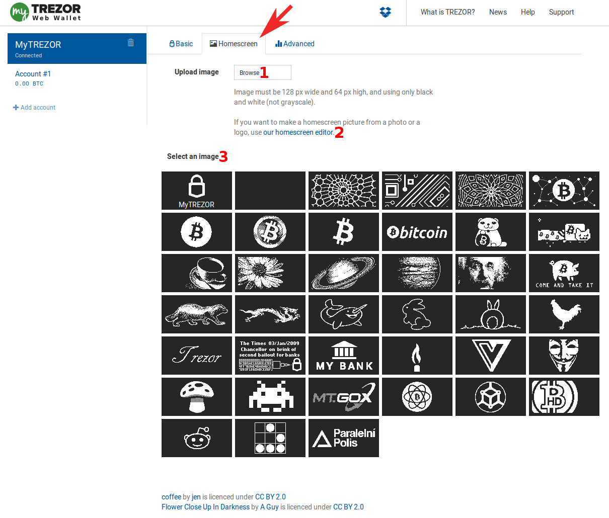
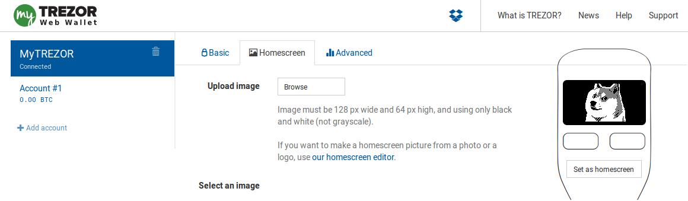
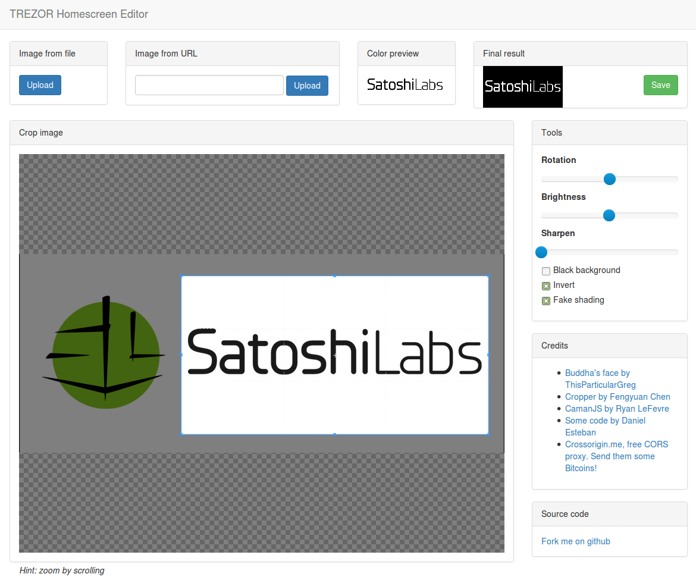
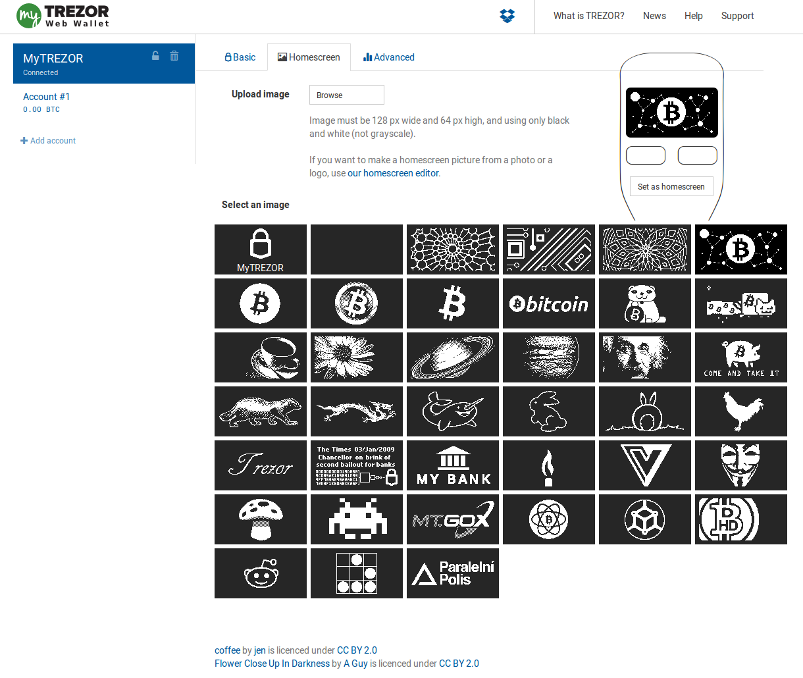

Homescreen
==========

.. note:: This feature is currently in open beta testing phase and is available at `beta.mytrezor.com <https://beta.mytrezor.com>`_. 

Personalize your TREZOR's homescreen easily. There are several ways how to do that:

- `1. Upload your own homescreen picture`_ or 
- `2. Use TREZOR Homescreen Editor`_ to upload and edit any picture or 
- `3. Choose from TREZOR Homescreen Gallery`_ 

1. Upload your own homescreen picture
-------------------------------------

Pictures have to be in the required format (128 x 64 px; black & white only).

- 1. click the **Browse** button to locate the picture on your computer 
- 2. confirm the upload 
- 3. if you are satisfied with the homescreen preview, click on the **Set as homescreen** button. You will be asked to confirm the action on your TREZOR device.

Done!

.. image:: images/homescreen-trezor.png
	:width: 50%

2. Use TREZOR Homescreen Editor
-------------------------------

- 1. Please click on the `homescreen editor <https://trezor.github.io/homescreen-editor/>`_ link if you wish to set your own picture as a TREZOR homescreen. You will be taken to another website.
- 2. Upload a picture from your harddrive or insert a link to the picture from the Internet
- 3. You can play with the settings such as brightness, sharpness and fake shading, you can rotate the picture and so on until you are happy with the preview. 
- 4. Save the prepared picture to your harddrive, return to `beta.mytrezor.com <https://beta.mytrezor.com>`_ and follow the steps to `1. Upload your own homescreen picture`_. 

3. Choose from TREZOR Homescreen Gallery
----------------------------------------

The most simple way to change your homescreen is to use some of the pictures in our gallery. 

- 1. Select your desired picture in the gallery 
- 2. Click the **Set as Homescreen** button in the preview area. You will be asked to confirm the action on your TREZOR device.

.. image:: images/homescreen-trezor.png 
	:width: 50%

Done!
