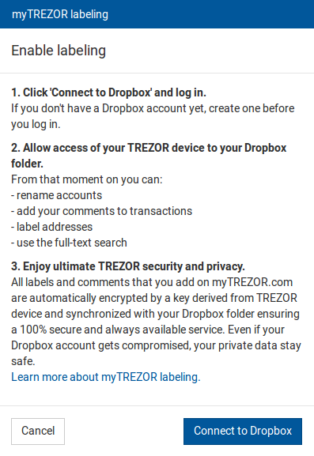
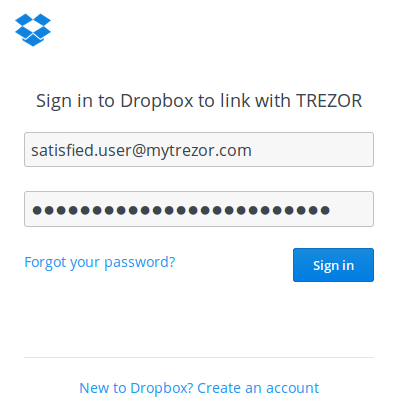
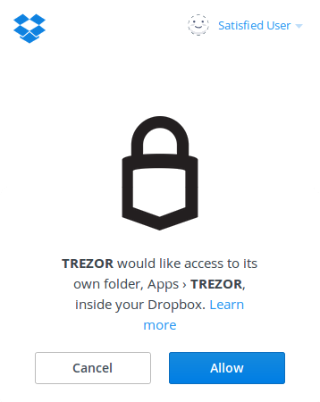
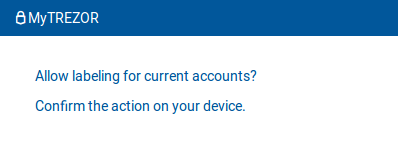
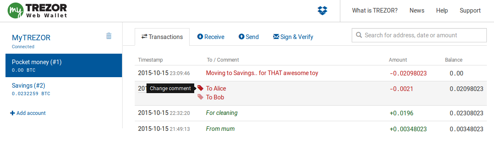

Labeling
========

.. note:: This feature is currently in open beta testing phase and is available at `beta.mytrezor.com <https://beta.mytrezor.com>`_. 

By connecting myTREZOR.com with Dropbox cloud storage, you can enjoy all these useful features:

- **Rename accounts**
- **Label receiving addresses**
- **Comment transactions**

This is a great way to organize your bitcoin wallet and keep a memory of your transaction activity.
Moreover, all your private data are ultimately secured and easily available from any computer. Every single information you add is automatically **encrypted by a key derived from TREZOR device** and uploaded to your personal Dropbox folder. 

.. image:: images/labeling-example.png 

Set up labeling: Connect Dropbox with your TREZOR
-------------------------------------------------

1. Click on the Dropbox icon in the top of the myTREZOR screen.

.. image:: images/labeling-connecttodropbox.png

2. Click on the “Continue” button in a pop-up window that appears.

3. Log into your Dropbox account. If you don't have any, create one, it’s free.

.. important:: When you log into your Dropbox account, there is a session cookie on Dropbox server with access to myTREZOR folder valid for about 5 years! We recommend to log out of your Dropbox account manually after you finish working with myTREZOR.com or use Private window in your browser for the best possible privacy.

4. Once logged in, TREZOR will ask for your permission to create a folder in your Dropbox where all the labels will be stored.

5. Finally, enable labeling on your TREZOR device. This will encrypt the files with your private key derived from TREZOR.

Congratulations! You are ready to use TREZOR Labeling.

Rename Accounts
---------------

Hover over the Account name area and click on the **tag icon**, enter a new account name and confirm by hitting the **Save icon**.

.. image:: images/labeling-account1.png
.. image:: images/labeling-account1a.png

Label receiving addresses
-------------------------

Labeling receiving addresses helps you identify incoming payments easily. You can label previously used addresses as well as the new ones and assign them to a specific purpose.  Simply type your label into the field next to the freshly created address and hit the **Save icon**. 

.. image:: images/labeling-receive.png

Whenever someone sends you a payment to an address that you labeled “For cleaning”, you will see this label in your Transactions history. 

Comment transactions
--------------------

Adding comments when sending transaction helps you keep track of your expenses. 
Let’s say you want to send money to two separate addresses (Alice and Bob) in one transaction. You can add a comment to every single address (output).

.. image:: images/labeling-send.png

When you switch back to “Transactions” tab, you will see one transaction with two commented addresses (outputs). You can change each of the comments separately.

How do TREZOR and Dropbox work together?
----------------------------------------

If you are interested how it works in the background, it's actually quite simple! MyTREZOR will create a folder “/apps/trezor/” in your Dropbox and store labels for every TREZOR account in separated file. You can back up those files and use them to restore all the labels in case you lost access to your Dropbox account!

Files and encrypted by AES-256 function using the TREZOR private key derived for this single purpose. It's also not possible to use Dropbox to reveal your payment history, your actual account balance or to rebuild your recovery seed!
