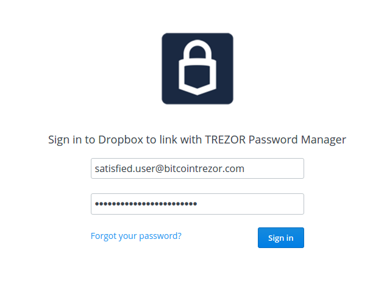
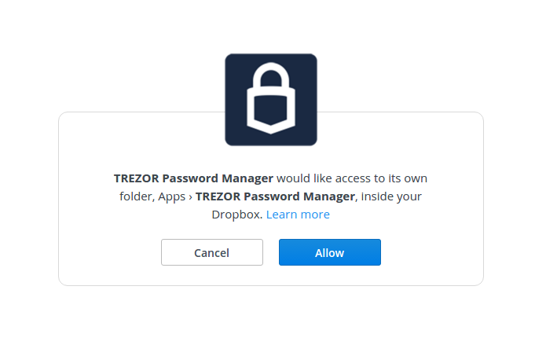
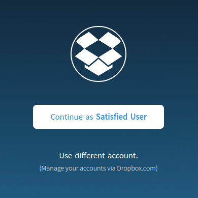
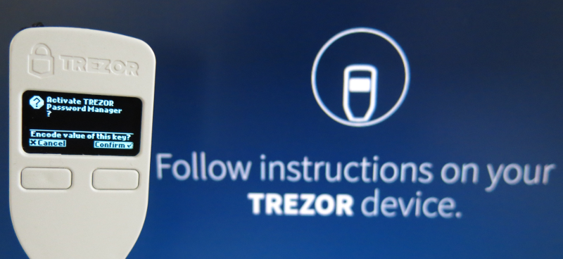

Password Manager
================

Please visit `TREZOR Password Manager <https://www.buytrezor.com/TREZOR_password_manager/>`_ page to find out why you need to use this app!

.. note:: This feature is currently in open beta testing phase and is available via `TREZOR Password Manager <https://chrome.google.com/webstore/detail/trezor-password-manager/imloifkgjagghnncjkhggdhalmcnfklk>`_ Chrome/Chromium extension. 

Set up Password Manager:
------------------------

1. Install TREZOR Chrome extension

If you are using TREZOR already, you might have it installed already. If not, please add the `TREZOR Chrome Extension <https://chrome.google.com/webstore/detail/trezor-chrome-extension/jcjjhjgimijdkoamemaghajlhegmoclj>`_ into your browser. For more information please check :doc:`settingup` manual page.

2. Install TREZOR Password Manager chrome extension

Please add the `TREZOR Password Manager <https://chrome.google.com/webstore/detail/trezor-password-manager/imloifkgjagghnncjkhggdhalmcnfklk>`_ Chrome/Chromium extension into your browser. Then click on the TREZOR icon in the top right corner of your browser.

3. Connect your Dropbox account with TREZOR

3.1. Click on the Sign in with Dropbox button.

.. image:: images/pm_connecttodropbox.png

3.2. Log into your Dropbox account. If you don't have any, create one, it’s free.

.. important:: When you log into your Dropbox account, there is a session cookie on Dropbox server with access to myTREZOR folder valid for about 5 years! We recommend to log out of your Dropbox account manually after you finish working with myTREZOR.com or use Private window in your browser for the best possible privacy.

3.3. Once logged in, TREZOR will ask for your permission to create a folder in your Dropbox where all the passwords will be stored.

3.4. Confirm using the Dropbox account

4. Connect TREZOR device

4.1. TREZOR Password Manager will ask you to connect the device.

.. images:: images/pm-connectdevice.png

4.2. Then you will be asked to enter your PIN. If you have troubles with it's concept, please refer to :doc:`enteringyourpin` manual page.

.. images:: images/pm-connectdevicepin.png

4.3. Finally, enable Password Manager on your TREZOR device. This will encrypt the files with your private key derived from your TREZOR.

Congratulations! You are ready to use TREZOR Password Manager.

Tags
----

Tags are used to filter entries instead of tree structure. You can create, edit and remove tags as you wish. Before you start to use TREZOR Password Manager, thing carefully about how many passwords you want to store and how to create sufficient and scalable tag structure. You can always filter more tags by using search bar.

You can see overview of your tags in the left pane. It's possible to edit name and icon of the tag or create a new one. Let's start with creating a new one. 

.. image:: images/pm-newtag.png

1. click to Add tag button on the bottom of the list of your tags.
2. Write down the name.
3. By using those little blue arrows you can switch between couple of icons.
4. When you are done, please click on the Save button.

If you wish to edit existing tag, just click on the tag name and three dots will apeear on the right. Click on them and you will find two options: Edit tag and Remove tag.

.. image:: images/pm-edittag.png

Entries
-------

To add an entry please click on the Add entry on the top of the page. 

.. image:: images/pm-newentry.png

You can enter for example "facebook.com" or "http://www.facebook.com" or even copypaste some weird long link into URL field. You will always see the entry by what you fill into Title field. Please keep in mind you can generate passwords by clicking on the two arrows button next to the password field. Add propriate tags and if you need, you can add so called Secret note (can be used for storing 2FA tokens etc.). When you are done please hit the Save button.

It's also possible to use TREZOR Password Manager to keep your bookmarks! (In such case it's enough to fill just URL and title when creating entry)

If you wish to change the order of the entries, it's possible to sort it only by date or name!

.. image:: images/pm-entryordering.png

Actions
-------

Most common and used action will be Open & Login. If you click on the entry name and you filled username and password, you will be asked to confirm the action on your TREZOR. 

.. note:: Please keep in mind the entry name works the same way as any other link so it depends on your browser settings or mouse button you use to click if the link will open in the same or new tab

.. image:: images/pm-openandloginapproval.png

After you approve the action, the site will be opened and login and password will prefill into the proper fields.

How do TREZOR and Dropbox work together?
----------------------------------------

If you are interested how it works in the background, it's actually quite simple! MyTREZOR will create a folder “/Apps/TREZOR Password Manager/” in your Dropbox and store labels for each TREZOR account in a separate file. You can back up those files and use them to restore all the labels in case you lose access to your Dropbox account!

Files are encrypted with AES-256 using a private key derived from your TREZOR for this single purpose. It's also not possible to use Dropbox to reveal list of your passwords, your actual logins & passwords or to rebuild your recovery seed!
