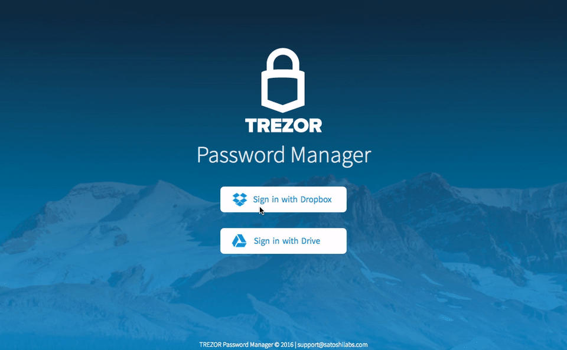
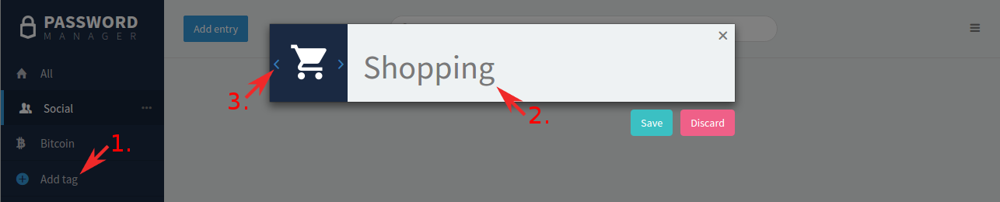
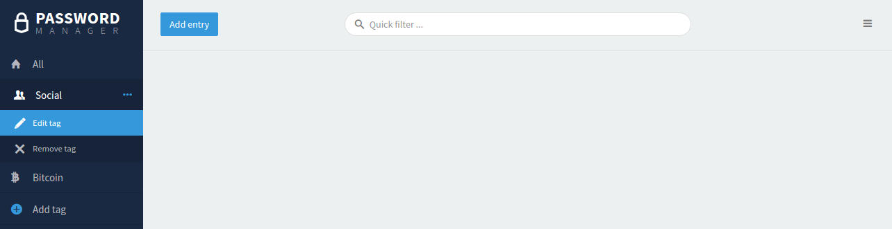
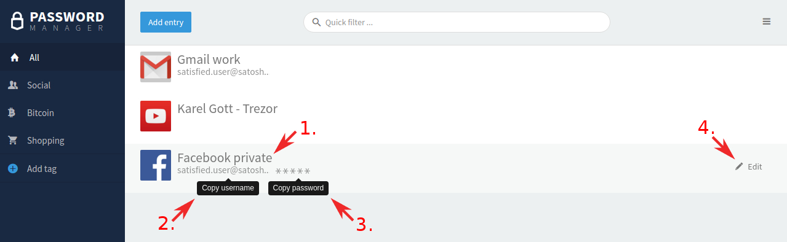

Password Manager
================

Visit `TREZOR Password Manager <https://passwords.mytrezor.com>`_ pages to learn why you need to use this app.

.. note:: TREZOR Password Manager is a Chrome extension currently released for public beta testing here: `TREZOR Password Manager <https://chrome.google.com/webstore/detail/trezor-password-manager/imloifkgjagghnncjkhggdhalmcnfklk>`_ Chrome/Chromium extension. 

Set up TREZOR Password Manager:
-------------------------------

You only need to perform this setup once. TREZOR Password Manager works with Chrome and cross-platform on your OSX, Windows, and Linux. 

**1. Check if you have TREZOR Chrome extension (TCE)**

If you are using TREZOR already, chances are you have the TCE installed already. If not, please add the `TREZOR Chrome Extension <https://chrome.google.com/webstore/detail/trezor-chrome-extension/jcjjhjgimijdkoamemaghajlhegmoclj>`_ to your browser. For more information please read the :doc:`settingup` manual page.

**2. Install TREZOR Password Manager Chrome extension (TPM)**

Please add the `TREZOR Password Manager <https://chrome.google.com/webstore/detail/trezor-password-manager/imloifkgjagghnncjkhggdhalmcnfklk>`_ Chrome/Chromium extension into your browser. Then click on the TREZOR icon in the top right corner of your browser.

**3. Connect your Dropbox account with TREZOR**

3.1. Click on the Sign in with Dropbox button and log into your Dropbox account. If you don't have any, create one, it’s free.

.. important:: When you log into your Dropbox account, there is a session cookie on Dropbox server with access to TREZOR Password Manager folder valid for about 5 years! We recommend to log out of your Dropbox account manually after you finish working with TREZOR Wallet or use a private window in your browser for the best possible privacy.

3.2. Give your TREZOR permission to create a folder in your Dropbox to store all the passwords in and confirm using the Dropbox account.

**4. Connect Your TREZOR device and enter your PIN** 

Learn how to enter PIN with TREZOR :doc:`enteringyourpin`

**5. Finally, enable Password Manager on your TREZOR device. This action will start encryption of your password files with your TREZOR.**

Congratulations! You are ready to use TREZOR Password Manager.
To be more visual, we created some simple GIFs for you:

.. image:: images/tpm_dropbox_final.gif

Using TPM with Google Drive
--------------------

Recently, we've taken next step towards the better and diverse TPM manager by integrating the Google Drive. At first, our customers were forced to use or create a Dropbox account. Now, you can use either Dropbox or Google Drive instead. 

Connecting your TPM to Google Drive is not very different from the Dropbox. 

Tags
----

Tags are used to filter and find entries easily. You can create, and remove tags as you wish. 

You can see the overview of your tags in the left pane. You can edit the name and the icon of the tag. But let's start with creating a new page first. 

1. click to Add tag button on the bottom of the list of your tags.
2. Write down the name.
3. Switch between the list of available icons by using little blue arrows.
4. When done, click "Save".

If you wish to edit an existing tag, just click on its name and edit or remove the tag navigating through the three dots on the right.

Add a Password Entry
--------------------

To add a new password please click "Add entry" on the top of the page. 

.. image:: images/pm-newentry.png

- **URL**: Enter the login URL of the service.
- **Title**: Keep the same as URL or rename if needed (e.g. to identify several accounts with the same service.)
- **Username**:
- **Password**: Note that you can generate a new strong password.
- **Tags**: select from tag list below the field.
- **Secret note**: Does not appear in the passwords preview and can be used for example to store your 2FA tokens.

If you wish to change the order of the entries, it's possible to sort it by date or name!

.. image:: images/pm-entryordering.png

Manage your bookmarks with TREZOR Password Manager
--------------------------------------------------

Simply "Add Entry" and fill in the URL and Title. Consider adding a tag "bookmarks" for faster search.

TREZOR Password Manager in Action
----------------------------------

- Open to login
- Copy username
- Copy password
- Edit

**1. Open to login**

Click on the entry name and a new tab with pre-filled user credentials will open. You will be asked to confirm this action on your TREZOR first. 

.. note:: Please keep in mind that opening a new tab depends on your browser or mouse settings and therefore your Password Manager might behave differently. 

.. image:: images/pm-openandloginapproval.png

**2. Copy username**

One click to copy the username into the clipboard.

**3. Copy password**

One click to copy the username into the clipboard. You will be asked to confirm the action on your TREZOR device.

**4. Edit entry**

In order to edit an entry, you will need to confirm the action on your TREZOR device.

Shortcuts
---------

There are some shortcuts available as well to improve the user experience.

**Shift + Alt + U** restarts the TREZOR Password Manager extension.

**Shift + Alt + F** fills in username and password to the login form of a website (that you have stored previously with TREZOR Password Manager).

Remember to have your TREZOR connected, otherwise, it won't work. (Hint: the little blue square in the corner of the Password Manager extension icon indicates your device is connected and credentials are stored for current site).

.. image:: images/pm-loginknownsite.png

How do TREZOR and Dropbox work together?
----------------------------------------

It's quite simple. TREZOR Password Manager creates a folder “/Apps/TREZOR Password Manager/” in your Dropbox and stores each password entry in a separate file and encrypted by your TREZOR device. 

We recommend you to back up those Dropbox files for the case you'd lose access to your Dropbox.

All files are `encrypted using keys derived from your TREZOR <https://github.com/satoshilabs/slips/blob/master/slip-0016.md>`_. In no way, it is possible for anyone else to access your passwords nor to make any edits!

Planned Improvements
--------------------

In the future, we plan to add the Import/Export feature and a direct login to Dropbox with TREZOR. 

