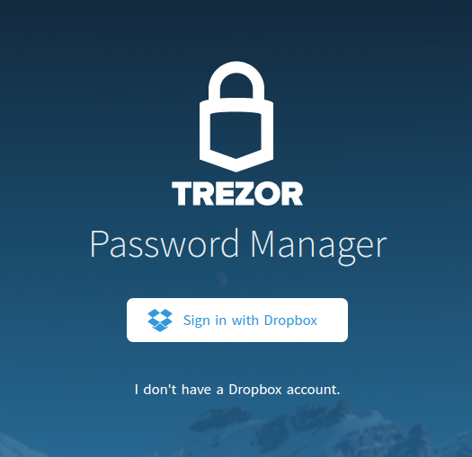

Password Manager
================

.. note:: This feature is currently in open beta testing phase and is available via `TREZOR Password Manager <https://chrome.google.com/webstore/detail/trezor-password-manager/imloifkgjagghnncjkhggdhalmcnfklk>`_ Chrome/Chromium extension. 

By connecting Password Manager with Dropbox cloud storage, you can enjoy all these useful features:

- **No need for master password - Each entry is unlocked separately**
- **Automatically filled credentials with Open & Login action**
- **Secret notes (such as 2FA tokens..)**

This is a great way to organize your passwords and keep a track of your bookmarks.
Moreover, all your private data are ultimately secured and easily available from any computer. All the information you add is automatically **encrypted by a key derived from your TREZOR device** and uploaded to your personal Dropbox folder. 

.. image:: images/pm-example.png 

Set up Password Manager:
----------------------------------------------------------

1. Install TREZOR Password Manager chrome extension

Please add the `TREZOR Password Manager <https://chrome.google.com/webstore/detail/trezor-password-manager/imloifkgjagghnncjkhggdhalmcnfklk>`_ Chrome/Chromium extension into your browser. Then click on the TREZOR icon in the top right corner of your browser.

2. Connect your Dropbox account with TREZOR

2.1. Click on the Sign in with Dropbox button.

2.2. Log into your Dropbox account. If you don't have any, create one, it’s free.

.. image:: images/pm-dropboxlogin.png

.. important:: When you log into your Dropbox account, there is a session cookie on Dropbox server with access to myTREZOR folder valid for about 5 years! We recommend to log out of your Dropbox account manually after you finish working with myTREZOR.com or use Private window in your browser for the best possible privacy.

2.3. Once logged in, TREZOR will ask for your permission to create a folder in your Dropbox where all the passwords will be stored.

.. image:: images/labeling-dropboxapproval.png

5. Finally, enable labeling on your TREZOR device. This will encrypt the files with your private key derived from your TREZOR.

.. image:: images/labeling-allowlabeling.png

Congratulations! You are ready to use TREZOR Labeling.

Rename Accounts
---------------

Hover over the Account name area and click on the **tag icon**, enter a new account name and confirm by hitting the **Save icon**.

.. image:: images/labeling-account1.png
.. image:: images/labeling-account1a.png

Label receiving addresses
-------------------------

Labeling receiving addresses helps you identify incoming payments easily. You can label previously used addresses as well as the new ones and assign them to a specific purpose.  Simply type your label into the field next to the freshly created address and hit the **Save icon**. 

.. image:: images/labeling-receive.png

Whenever someone sends you a payment to an address that you labeled “For cleaning”, you will see this label in your Transactions history. 

Comment transactions
--------------------

Adding comments when sending transaction helps you keep track of your expenses. 
Let’s say you want to send money to two separate addresses (Alice and Bob) in one transaction. You can add a comment to every single address (output).

.. image:: images/labeling-send.png

When you switch back to the “Transactions” tab, you will see one transaction with two commented addresses (outputs). You can change each of the comments separately.

.. image:: images/labeling-transactions2.png

How do TREZOR and Dropbox work together?
----------------------------------------

If you are interested how it works in the background, it's actually quite simple! MyTREZOR will create a folder “/Apps/TREZOR Password Manager/” in your Dropbox and store labels for each TREZOR account in a separate file. You can back up those files and use them to restore all the labels in case you lose access to your Dropbox account!

Files are encrypted with AES-256 using a private key derived from your TREZOR for this single purpose. It's also not possible to use Dropbox to reveal list of your passwords, your actual logins & passwords or to rebuild your recovery seed!
