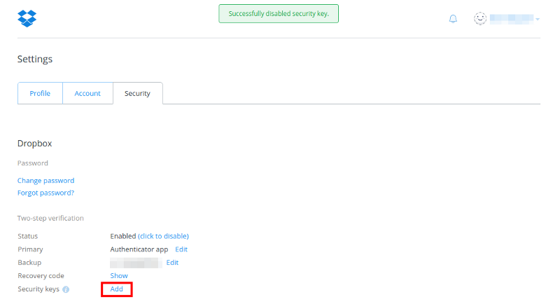
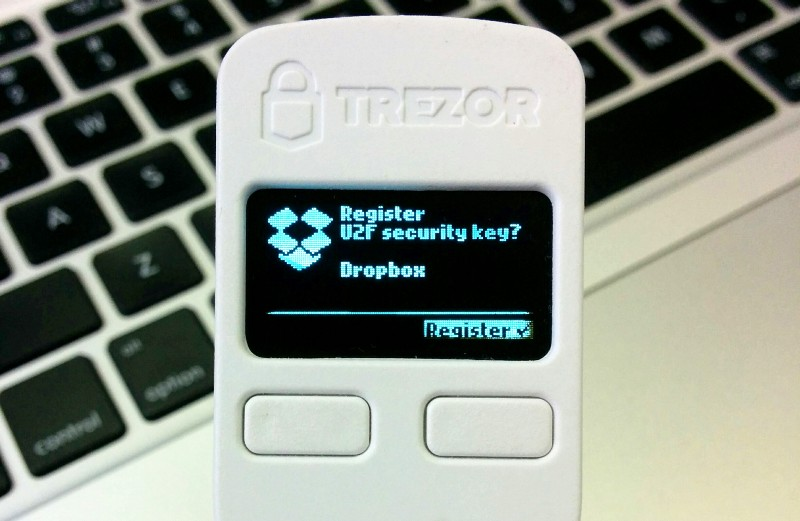
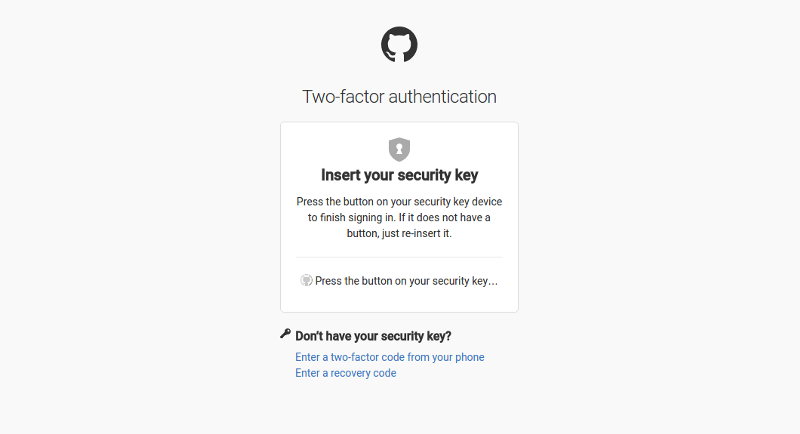

Two-factor Authentication (U2F)
===============================

Two-factor authentication (2FA) is currently the most common way how you can protect your online accounts from unauthorized access. In addition to what you know (your username and password), you use something that only you have — a phone, an app or a specialized hardware token, in order to login securely.

However, some methods of 2FA are inherently insecure. The most popular 2FA implementation, Time-based One-Time Password (TOTP), popularized by its use on Google Auth services, transmits the shared secret (master key) over the internet during the setup process. This weakness has been recognized by major players who created FIDO Alliance and defined new, more secure standards such as U2F.

Starting with firmware 1.4.0, TREZOR officially supports the U2F specification. After updating your device firmware, you can start using TREZOR as your 2nd factor authentication token with services such as Google or Dropbox. Check out services using U2F at dongleauth.info.

One further improvement of TREZOR on top of U2F is that TREZOR users can truly verify what they are about to authorize via the on-device display. 

How to Setup TREZOR as a U2F key?
---------------------------------

In this short tutorial, we will use Dropbox as the example, however all services should have a similar setup procedure.

In Settings, click on ‘Add’ to setup TREZOR as your U2F Security Key

Plug in your TREZOR

.. image:: images/u2f-dropbox2.png

Wait for the prompt on your TREZOR

.. image:: images/u2f-dropbox3.png

Confirm after checking

Done! You can start using TREZOR to log into Dropbox alongside with a simple password.

.. image:: images/u2f-dropbox5.png

Using TREZOR as a U2F Key
-------------------------

We are using GitHub as an example, but all services should have similar login procedures.

Login as usual

.. image:: images/u2f-github1.png

Plug in TREZOR

The device will not ask you for your PIN. Your login credentials for the service serve as the first factor. Your TREZOR as the second factor.

.. image:: images/u2f-github3.jpg
